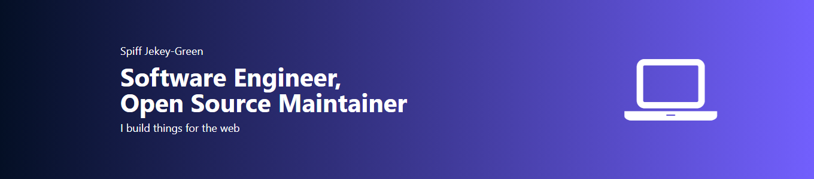

<!--  -->
<!-- ----------------------- -->

  
  ## Hello world 

<!--    -->
  <a href="https://discord.gg/hKQc8SX9zP" target="_blank">
    
   <a/>
  <a href="https://linkedin.com/in/spiff-jekey-green" target="_blank">
    
  <a/>
  <a href="https://twitter.com/spiffGreen" target="_blank">
    
  <a/>
  
  <h4>Software Engineer | Student Developer</h4>
 

### ABOUT ME
Hi, 👋I’m Spiff Jekey-Green, a Software Engineer and open-source maintainer, primarily building things for the web 🌍, who believes in changing the world by building applications that are efficient and reliable using well-defined scientific principles and procedures. I am constantly challenging and improving myself to solve business problems with IT. I am currently available and open to new ideas and contributing to society. 

### LETS TALK
🚀You can connect with me:

<!-- * [Twitter](https://twitter.com/spiffGreen)
* [LinkedIn](https://ng.linkedin.com/in/spiff-jekey-green-315199212) -->

 

<!-- ### SKILLS
  

 

 -->
  
### WORK EXPERIENCE
* Freelancer
* Software Developer Intern

### IMPORTANT DOCS AND LINK
* [Resume](./SpiffJG_Resume.pdf)
* [Portfolio](https://spiffgreen.pages.dev)
    
### THINGS I'VE DONE
* [Netflix Home Page Clone](https://spiff-netflix-clone.vercel.app/)
* [App Home Page Clone](https://spiff-apple-clone.netlify.app/)
* [PearlFisc Telegram Bot](https://t.me/PearlFiscBot)
* [Zrack Test](https://zrack.herokuapp.com/)

**LANGUAGES and TOOLS:**  

 

<!-- 
<code></code>
<code></code>
<code></code>
<code></code>
<code></code>
<code></code>
<code></code>
<code></code>
<code></code>
<code></code> -->

### SUPPORT ME
if you like what i do, maybe consider buying me a coffee/tea 🥺👉👈

### Stats
|Github Stats|Language Stats|
|:---:|:---:|
|
